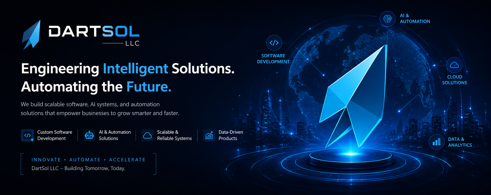

  

 

<h1 align="center">⚡ DartSol LLC</h1>

<h2 align="center">We Engineer Intelligence. We Ship Products.</h2>

<h4 align="center">
  🤖 AI Systems &nbsp;&nbsp;·&nbsp;&nbsp; 🚀 SaaS Development &nbsp;&nbsp;·&nbsp;&nbsp; ⚙️ Intelligent Automation &nbsp;&nbsp;·&nbsp;&nbsp; 🌐 Full-Stack Engineering
</h4>

 

---

 

<h2 align="center">🏢 Who We Are</h2>

 

  <b>DartSol LLC</b> is an AI-first software company building intelligent systems, scalable SaaS platforms, 
  and automation infrastructure for startups, businesses, and enterprises worldwide.

 

---

 

<h2 align="center">🛠️ What We Build</h2>

 

| 🤖 AI Agents & Chatbots | 📦 SaaS Products | 🌐 Full-Stack Web Apps |
|:---:|:---:|:---:|
| OpenAI · LangChain · LangGraph | End-to-end · MVP to Scale | Next.js · MERN · FastAPI |

| ⚙️ Business Automation | 📊 Dashboards & CRMs | 🔌 API & Backend Systems |
|:---:|:---:|:---:|
| n8n · Zapier · Make | RBAC · Analytics · Real-time | REST · Integrations · Cloud |

 

---

 

<h2 align="center">💻 Tech Stack</h2>

 

<h4 align="center">— Frontend —</h4>

  
  
  

<h4 align="center">— Backend —</h4>

  
  
  

<h4 align="center">— Database —</h4>

  
  
  

<h4 align="center">— AI & Automation —</h4>

  
  
  
  
  
  

<h4 align="center">— DevOps —</h4>

  
  
  

 

---

 

<h2 align="center">🚀 Featured Projects</h2>

 

| 🏷️ Project | 🔧 Stack | 📈 Impact |
|:---|:---|:---|
| 🧠 **AI Resume Builder SaaS** | Next.js · OpenAI · Stripe | 2,000+ users in 60 days |
| 📋 **Smart CRM Automation** | React · n8n · PostgreSQL | 3x pipeline throughput |
| 💬 **AI Customer Support Agent** | LangGraph · FastAPI · Supabase | 60% ticket deflection |
| 🛒 **E-Commerce Automation Engine** | n8n · Shopify API · MongoDB | 40+ hrs/week saved |
| 📊 **Admin Dashboard with RBAC** | Next.js · Express · Docker | $2M+ monthly volume |
| 📄 **Document AI Pipeline** | LangChain · HuggingFace · AWS | Hours → seconds |

 

---

 

<h2 align="center">⚡ Why DartSol</h2>

 

| 🚀 Fast Delivery | 📐 Scalable Architecture | 🧠 AI-First Mindset |
|:---:|:---:|:---:|
| Ship fast, ship right | Built to grow from day one | Intelligence at the core |

| 🧹 Clean Code | 📊 Business Impact | ⚙️ Automation-First |
|:---:|:---:|:---:|
| Production-grade always | Metrics over features | If it repeats, we automate it |

 

---

 

<h2 align="center">📊 GitHub Stats</h2>

 

  
  

  

  

  

 

---

 

<h2 align="center">📬 Let's Build Together</h2>

 

  
  &nbsp;&nbsp;
  

 

<h3 align="center"><i>Building intelligent systems that scale globally.</i></h3>

 

  

 

  &copy; 2026 DartSol LLC · All Rights Reserved

